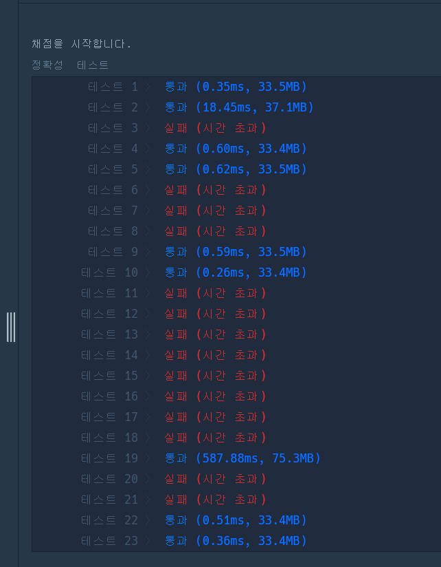

# 문제 링크

프로그래머스 Lv2. 리코쳇 로봇
https://school.programmers.co.kr/learn/courses/30/lessons/169199

# 1. 내 풀이

```js
// 상: 0, 하: 1, 좌: 2, 우: 3
const MOVESTEP = [
    [1, 0],
    [-1, 0],
    [0, -1],
    [0, 1],
];

function solution(board) {
    let [i, j] = searchValue(board, 'R');
    let [goal_i, goal_j] = searchValue(board, 'G');

    let defensed = 0;
    MOVESTEP.forEach((direction) => {
        let moved_i = goal_i + direction[0];
        let moved_j = goal_j + direction[1];
        if (
            board[moved_i][moved_j] == 'D' ||
            moved_i < 0 ||
            moved_i >= board.length ||
            moved_j < 0 ||
            moved_j >= board[0].length
        ) {
            defensed++;
        }
    });

    if (defensed == 0) return -1;

    const queue = [];
    MOVESTEP.forEach((_, direction) => {
        queue.push({ prevD: -1, moved: move(board, i, j, direction), cur_step: 1 });
    });

    let step = -1;
    while (queue.length && step < 0) {
        let { prevD, moved, cur_step } = queue.shift();
        let [cur_i, cur_j, next] = moved;

        if (next == 0) continue;

        if (board[cur_i][cur_j] == 'G') {
            step = cur_step;
            break;
        }

        MOVESTEP.forEach((_, direction) => {
            if (prevD == direction) return;

            queue.push({ prevD: direction, moved: move(board, cur_i, cur_j, direction), cur_step: cur_step + 1 });
        });
    }

    return step;
}

function move(board, i, j, direction) {
    const targetDirection = MOVESTEP[direction];

    let next = 0;
    while (true) {
        i += targetDirection[0];
        j += targetDirection[1];

        if (i < 0 || i >= board.length) {
            i -= targetDirection[0];
            break;
        }

        if (j < 0 || j >= board[0].length) {
            j -= targetDirection[1];
            break;
        }

        if (board[i][j] == 'D') {
            i -= targetDirection[0];
            j -= targetDirection[1];
            break;
        }

        next++;
    }

    return [i, j, next];
}

function searchValue(board, value) {
    for (let i = 0; i < board.length; i++) {
        for (let j = 0; j < board[0].length; j++) {
            if (board[i][j] == value) return [i, j];
        }
    }
    return [-1, -1];
}
```



## 풀이 방법

1차 시도 : 제일 짧은 단계를 탐색하기 위해 BFS를 이용해 탐색한다. 전역 변수를 사용해 어딘가에서 진행이 끝났을 경우, 남은 탐색들을 진행하지 않는다. 배열을 이용해 Queue를 사용할 경우, unshift()는 원소의 불필요한 이동을 계속 만들어낸다. ... 역시나 시간초과.  
`GOAL` 지점에 멈추려면 `GOAL` 상하좌우에 한군데라도 막히는 지점이 있어야 한다.
2차 시도에는 unshift 사용을 멈추고 index를 이동시키거나, `queue`를 직접 구현해 보자. 만약 큰 차이가 없다면 GOAL 지점부터 역추적 하는 방법을 생각해보거나, visited를 만들어 똑같은 곳을 순회하는 경우를 막아주자.

# 2. 느낀 점

# 3. 배운 점
